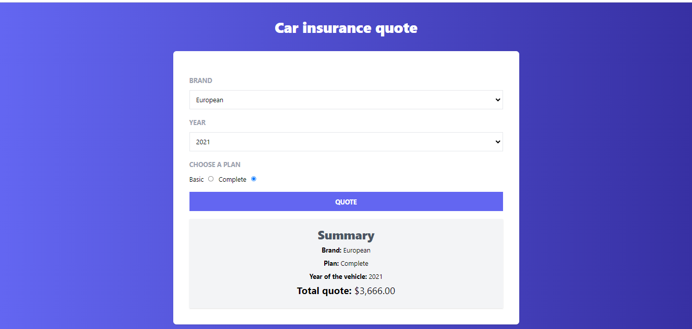
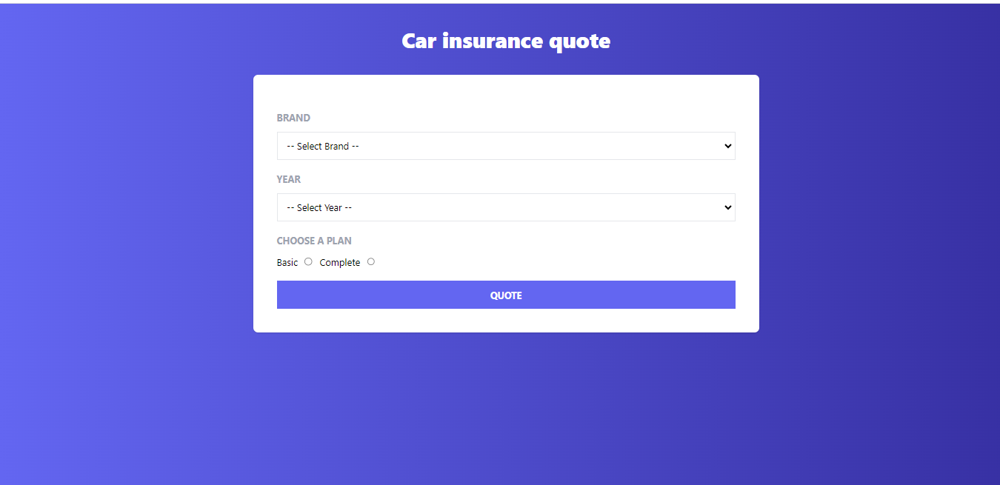

<div align="center">
  
  <h3><b>Insurance Quoter React App</b></h3>

  

  

  <br/>

  

</div>

# 📗 Table of Contents <a name="table-of-contents"></a>

- [📗 Table of Contents](#-table-of-contents-)
- [📖 About the Project](#-about-the-project-)
  - [🚀 Live Demo ](#-live-demo-)
  - [🛠 Built With](#-built-with-)
    - [Tech Stack](#tech-stack-)
    - [Key Features](#key-features-)
  - [🚀 Getting Started](#-getting-started-)
    - [Prerequisites](#prerequisites)
    - [Setup](#setup)
    - [Install](#install)
    - [Usage](#usage)
  - [👥 Authors](#-authors-)
  - [🤝 Contributing](#-contributing-)
  - [📝 License](#-license-)

<!-- PROJECT DESCRIPTION -->

# 📖 About the Project <a name="about-project"></a>

**Auto Insurance Quote React App** is a web application built with React Vite that allows users to get auto insurance quotes. The application uses the Context API to manage the global state of the form data. Each field in the form represents a variant of the insurance price. The app also includes functionalities like a spinner and conditional components to enhance the user experience.

This app was created as part of the course "React - The Complete Guide: Hooks Context Redux MERN +15 Apps"!
<!-- LIVE DEMO -->

## 🚀 Live Demo <a name="live-demo"></a>

- [Live Demo](https://insurance-quoter-mkg5oqrtw-gabriels-projects-636b023b.vercel.app/)


<p align="right">(<a href="#readme-top">back to top</a>)</p>

## 🛠 Built With <a name="built-with"></a>

### Tech Stack <a name="tech-stack"></a>

<details>
  <summary>Client</summary>
  <ul>
    <li>HTML, Tailwind, JavaScript</li>
    <li><a href="https://reactjs.org/">React.js</a></li>
    <li><a href="https://es.vitejs.dev/">Vite</a></li>
    
  </ul>
</details>

# 🚀 Getting Started <a name="getting-started"></a>

To get a local copy up and running, follow these steps.

### Setup

1. Clone this repository to your desired folder:

```sh
git https://github.com/cilfonegabriel/insurance-quoter.git
cd insurance-quoter


### Install

After cloning the repo, navigate into it and install all the required packages with the following command:

```sh

npm install


```

Then just wait for everything to finish downloading.

### Usage

Start the React app:

`npm run dev`

Runs the app in the development mode.\
Open [http://localhost:3000](http://localhost:3000) to view it in your browser.

The page will reload when you make changes.\
You may also see any lint errors in the console.

`npm run eject`


### Deployment

You can deploy this project using:

`npm run build`

This project is deployed in Vercel.

See the section about [deployment](https://facebook.github.io/create-react-app/docs/deployment) for more information.

<p align="right">(<a href="#readme-top">back to top</a>)</p>

<!-- AUTHORS -->

## 👥 Authors <a name="authors"></a>

👤 **Gabriel -Cilfone**
- GitHub: [Gabriel Cilfone](https://github.com/cilfonegabriel)
- LinkedIn: [Gabriel Cilfone](www.linkedin.com/in/gabriel-cilfone/)

<p align="right">(<a href="#readme-top">back to top</a>)</p>

<!-- FUTURE FEATURES -->

## 🔭 Future Features <a name="future-features"></a>

- [ ] **Context API**
- [ ] **Form input**
- [ ] **Deploy a live demo**
- [ ] **Spinner**
- [ ] **Conditional components**


<p align="right">(<a href="#readme-top">back to top</a>)</p>

<!-- CONTRIBUTING -->

## 🤝 Contributing <a name="contributing"></a>

Contributions, issues, and feature requests are welcome!

Feel free to check the [issues page](https://github.com/cilfonegabriel/insurance-quoter/issues).

<p align="right">(<a href="#readme-top">back to top</a>)</p>

<!-- SUPPORT -->

<p align="right">(<a href="#readme-top">back to top</a>)</p>

<!-- ACKNOWLEDGEMENTS -->

## 🙏 Acknowledgments <a name="acknowledgements"></a>

 This app was created as part of the course "React - The Complete Guide: Hooks Context Redux MERN +15 Apps"!
<p align="right">(<a href="#readme-top">back to top</a>)</p>

## 📝 License <a name="license"></a>

This project is [MIT](./LICENSE) licensed.

<p align="right">(<a href="#readme-top">back to top</a>)</p>